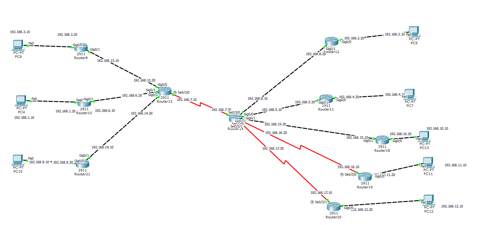

# 计算机网络实验

## 第一次

> 一个路由器`2960-24TT Switch`，两台PC  
> PC之间通信  

给每台PC配置`IP地址`，`子网掩码`  
`192.168.1.1` `255.255.255.0`  
与路由器之间使用直连线`Copper Straight-Through`连接


> 两个路由器，两台PC  
> PC之间通信

路由器之间使用交叉线连接`Copper Cross-Over`

<!--more-->
## 第二次 配置VLAN
> 一台交换机，n台PC  
> 同一个交换机中不同VLAN下的PC不能通信  
0. PC配置IP地址，子网掩码，与路由器连接
1. 创建VLAN
```shell
Switch>enable
Switch#configure terminal
Switch(config)#vlan 3
Switch(config-vlan)#name VLAN3
Switch(config-vlan)#exit
```
2. 给端口划分VLAN
```shell
Switch(config)#interface FastEthernet0/5
Switch(config-if)#switchport access vlan 3
Switch(config-if)#exit
```

## 第三次 配置TRUNK
> 3台交换机，n台PC  
> 同一个交换机下不同VLAN之间的PC不能通信  
> 不同交换机之间相同VLAN下的PC可以通信  

0. PC配置IP地址，子网掩码，PC与路由器连接，路由器之间连接  
1. 两台连接PC的路由器配置VLAN  
2. 连接路由器的路由器配置TRUNK
```shell
Switch>enable
Switch#configure terminal
Switch(config)#interface FastEthernet0/3
Switch(config-if)#switchport mode trunk
Switch(config-if)#exit
```
3. TRUNK与TRUNK之间交叉线连接

## 第四次 交换机端口安全
> 抄凯玥的 以后再补
一般配置

> enable //进入特权
>
> configgure terminal //全局配置
>
> inter f0/1 
>
> switchport mode access  //切换模式
>
> switchport port-security  //开启端口安全
>
> switchport port-security mac-address xxxx.xxxx.xxxx //注册mac地址
>
> switchport port-security maximum xx //设置最大注册数
>
> switchport port-security violation shutdown (不知道的时候输？) //选择非注册mac连接时行为
>
> no shutdown 
>
> 两次exit 
>
> show port-security查看安全设置

非注册mac访问后重启端口

> en
>
> config t
>
> inter f0/1
>
> shutdown
>
> no shutdown

设置sticky模式

> en
>
> config t
>
> inter f0/1
>
> no switchport port-security
>
> switchport port-security
>
> switchport port-security mac-address sticky
>
> switchport port-security maximum xx
>
> switchport port-security violation shutdown
>
> 两次exit 
>
> show port-security查看安全设置  
> 

## 第五次 使用路由器连接PC
> 2台PC，1台交换机，2台路由器`2911 Router`  
> PC-直连线-交换机-直连线-路由器-Seria DCE-路由器-交叉线-PC  
> 两个网络之间的PC可以通信

0. PC配置IP地址，子网掩码
1. 路由器关机，插入HWIC-2T，开机
2. 配置路由器
```shell
Router>enable
Router#configure terminal
Router(config)#interface GigabitEthernet0/2
Router(config-if)#ip address 192.168.1.1 255.255.255.0
Router(config-if)#exit
Router(config-if)#no shutdown
```
3. 两台路由器之间使用`Seria DCE`连接，端口Seria0/3/0 (被连线的一方不需要设定`clock rate`)
```shell
Router>enable
Router#configure terminal
Router(config)#interface Serial0/3/0
Router(config-if)#ip address 192.168.2.1 255.255.255.0
Router(config-if)#clock rate 1000000
```
4. 配置下一跳
```shell
Router>enable
Router#configure terminal
Router(config)#ip route 192.168.3.0 255.255.255.0 192.168.2.2 //ip route 192.168.3.0 255.255.255.0 s0/3/0
Router(config)#no shutdown
```

## 第六次 静态路由 下一跳
> 和上次类似  
> 注：PC的网关，路由器的NetWork为最终目的地




